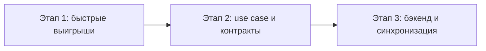

# Поэтапный план внедрения архитектурных изменений

План привязан к приоритетному сценарию масштабирования (по умолчанию — до 10k пользователей, см. [ARCHITECTURE_SCALING_SCENARIOS.md](ARCHITECTURE_SCALING_SCENARIOS.md)). После согласования с заказчиком приоритетный сценарий и сроки можно скорректировать в том документе.

---

## Цель

- Укрепить архитектуру без смены технологического стека (офлайн, Drift, Riverpod, GetIt).
- Подготовить базу для сценариев 100k и 1M: явный слой use case, абстракции репозиториев, контракты API.

---

## Этап 1. Быстрые выигрыши (текущие релизы)

**Срок:** ближайшие 1–2 спринта.

1. **Внедрить SaveExaminationUseCase на экране создания/редактирования протокола**
   - Зарегистрировать `SaveExaminationUseCase` в DI ([lib/core/di/di_container.dart](../lib/core/di/di_container.dart)), передавая репозитории из GetIt.
   - В [ExaminationCreatePage](lib/features/examinations/presentation/pages/examination_create_page.dart): в `_saveExamination()` формировать `SaveExaminationInput` (в т.ч. `preferredClinicId` из SharedPreferences в виджете), вызывать use case, обрабатывать `SaveExaminationResult` (успех → инвалидация провайдеров, навигация; ошибка валидации → setState с сообщением). Удалить из страницы дублирующую логику валидации, сборки `Examination` и прямые вызовы репозиториев для сохранения.
   - Оставить в виджете только: чтение preferredClinicId из SharedPreferences, вызов use case, обновление UI по результату.

2. **Голосовой поиск пациентов**
   - Ввести use case (или фасад) «голосовой поиск»: на вход путь к аудио, на выход — текст (вызов `SttRouter.transcribe`). Зарегистрировать в DI.
   - В [PatientsListPage](lib/features/patients/presentation/pages/patients_list_page.dart) в `_startVoiceSearch()` после получения пути к записанному файлу вызывать use case вместо `getIt<SttRouter>()` напрямую; обновлять `patientSearchQueryProvider` и поле поиска по результату.

3. **Унификация DI на затронутых экранах**
   - Зафиксировать правило: на ExaminationCreatePage и PatientsListPage доступ к репозиториям и use case — только через внедрение (конструктор или Riverpod-провайдер), без прямых вызовов `getIt<>()` в теле виджета для бизнес-логики. GetIt допускается в провайдерах Riverpod для получения синглтонов.

**Результат этапа:** уменьшение объёма бизнес-логики в крупных виджетах, один полноценный use case в коде (SaveExamination), предсказуемый доступ к зависимостям на двух ключевых экранах.

---

## Этап 2. Архитектурные опоры под 100k

**Срок:** после стабилизации этапа 1, по плану продукта.

1. **Слой use case по основным фичам**
   - Реализовать и зарегистрировать в DI use case’ы по [ARCHITECTURE_USECASES.md](ARCHITECTURE_USECASES.md): пациенты (GetPatientsList, SearchPatients, AddPatient, UpdatePatient, DeletePatient, GetPatientCount, PatientVoiceSearch уже частично), осмотры (GetExaminationById, GetExaminationsByPatient, DeleteExamination — SaveExamination уже есть), шаблоны (GetActiveTemplates, GetTemplateById), экспорт/импорт (оформить ExportService/ImportService с внедрением репозиториев через конструктор).
   - По мере рефакторинга переносить вызовы репозиториев из страниц в use case’ы.

2. **Абстракции для удалённого хранилища**
   - Доменные интерфейсы репозиториев не менять. Подготовить (на уровне пакетов/модулей или черновых классов) интерфейсы или заглушки для API-клиента (например, `ApiClient` с методами `getPatients()`, `saveExamination()`, …) и описание контрактов в [ARCHITECTURE_BACKEND_CONTRACTS.md](ARCHITECTURE_BACKEND_CONTRACTS.md). Реализацию RemoteRepository можно отложить до появления реального бэкенда.

3. **Черновой API-контракт**
   - Зафиксировать в репозитории или в отдельном документе версию контракта (например, OpenAPI-файл или маркдаун с эндпоинтами и форматами запросов/ответов) на основе ARCHITECTURE_BACKEND_CONTRACTS.md для согласования с бэкенд-командой.

**Результат этапа:** явный слой use case по основным сценариям, UI не зависит от типа источника данных, готовность к появлению бэкенда и RemoteRepository.

---

## Этап 3. Движение к 1M (при появлении бэкенда)

**Срок:** после запуска или стабильной разработки бэкенда.

1. **Реализация удалённых репозиториев и синхронизации**
   - Реализовать `*RemoteRepository` по контрактам из ARCHITECTURE_BACKEND_CONTRACTS.md; подставлять их в DI в зависимости от режима (онлайн/офлайн) или реализовать гибридный слой (sync service), объединяющий локальную БД и API с очередью изменений и разрешением конфликтов.
   - Постепенно переводить use case’ы на работу с «единым» репозиторием (локальный кэш + синхронизация или только удалённый), не меняя контракты use case’ов.

2. **Мониторинг и конфигурация**
   - Внедрить логирование и трассировку ключевых операций (создание/обновление протокола, экспорт, импорт, ошибки API) для анализа при росте числа пользователей.
   - Вынести лимиты (количество пациентов, размер медиа, глубина истории) в конфигурационные сущности или удалённый конфиг, не зашивать в код.

**Результат этапа:** клиент готов к работе с облачным бэкендом, офлайн-режим и синхронизация поддерживаются, архитектура допускает масштабирование до 100k/1M при развитии серверной части.

---

## Зависимости между этапами

- Этап 1 не блокирует текущие релизы и может выполняться пошагово (сначала SaveExamination, затем голосовой поиск).
- Этап 2 можно начинать параллельно с доработками по этапу 1 (например, ввод остальных use case’ов).
- Этап 3 зависит от наличия или плана бэкенда; подготовка контрактов и абстракций на этапе 2 сокращает время выхода облачного режима.

---

## Связь с реестром артефактов

Задачи по внедрению архитектурных изменений при необходимости регистрируются в [ARTIFACTS.md](ARTIFACTS.md) с префиксом VET-NNN и привязкой к данному плану (например, «Декомпозиция плана архитектурного развития, этап 1»).
